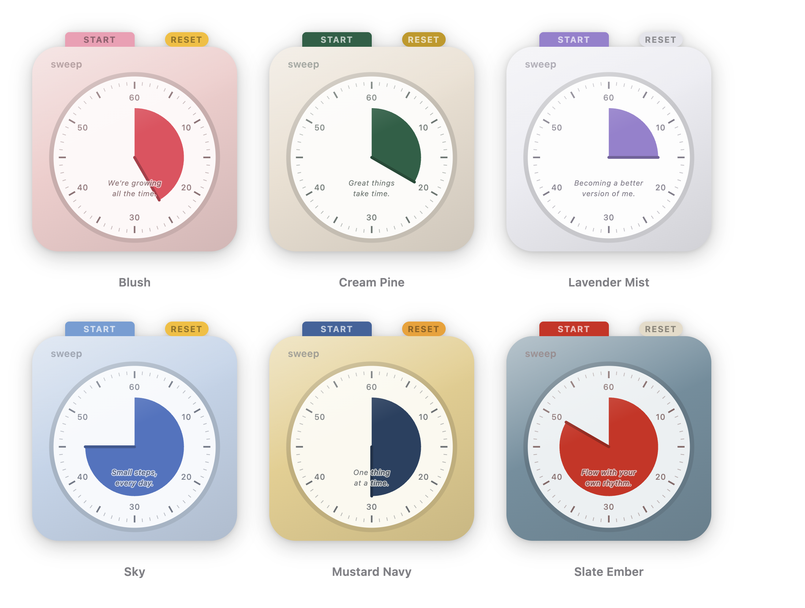

# Sweep

[繁體中文](README.md) · [简体中文](README.zh-Hans.md) · [日本語](README.ja.md) · [English](README.en.md) · **Français**

Un compte à rebours d'étude flottant pour macOS et Windows, inspiré du minuteur à cadran :
un secteur coloré revient vers zéro, et le cadran clignote quand le temps est écoulé.



- Flotte au-dessus de toutes les fenêtres. Sur macOS cela couvre tous les Spaces, y compris ceux en plein écran d'autres apps ; Windows n'a pas d'équivalent, la fenêtre reste sur le bureau virtuel où elle a été ouverte
- Deux apparences : le boîtier complet avec ses boutons, ou le cadran seul pour un minimum de distraction
- Six palettes reprises du minuteur d'origine, plus des palettes personnalisées à quatre couleurs
- Réglez la durée en faisant tourner le cadran ou en saisissant les minutes (1–60)
- Chaque séance terminée est enregistrée ; l'historique montre les anneaux du jour et les 30 derniers jours
- Opacité réglable séparément pendant une séance et au repos ; le survol la ramène toujours à l'opacité pleine
- Les boutons cliquent, la remise à zéro balaie, et une note douce marque la fin
- Chinois traditionnel, chinois simplifié, japonais, anglais et français, choisis d'après la langue du système au premier lancement

## Installation

Téléchargez depuis la page [Releases](../../releases) :

| Fichier | Pour |
|---|---|
| `Sweep-<version>-arm64.dmg` | Mac, Apple Silicon |
| `Sweep-<version>-x64.dmg` | Mac, Intel |
| `Sweep-<version>-win-x64.exe` | Windows 10/11, 64 bits |

Aucune des deux builds n'est signée : chaque système protestera une fois.

**macOS** — glissez Sweep dans Applications, puis retirez l'attribut de quarantaine :

```sh
xattr -dr com.apple.quarantine "/Applications/Sweep.app"
```

**Windows** — SmartScreen signalera un éditeur inconnu. Choisissez
**Informations complémentaires**, puis **Exécuter quand même**.

## Lancer depuis les sources

```sh
npm install
npm start
```

## Utilisation

| Action | Comment |
|---|---|
| Régler la durée | Faites glisser dans le cadran — sens horaire pour ajouter, antihoraire pour retirer |
| Saisir une durée | Double-cliquez sur le cadran, entrez 1–60, appuyez sur Entrée |
| Démarrer / pause | Cliquez sur le bouton central, ou sur la barre en haut |
| Remettre à zéro | Cliquez sur le bouton rond en haut ; en mode cadran seul, double-cliquez sur le bouton central |
| Déplacer | Faites glisser le boîtier ou la couronne graduée, ou ⌘/Ctrl-glissez n'importe où |
| Tout le reste | Clic droit : mode, taille, couleurs, langue, historique, réglages, quitter |

L'app n'apparaît ni dans le Dock ni dans la barre des tâches : quittez-la depuis
le menu contextuel (ou avec ⌘Q / Ctrl+Q lorsqu'une fenêtre a le focus).

## Organisation du code

```
main.js              fenêtre, comportement flottant, menu, stockage, notifications
preload.js           le pont IPC exposé aux pages sous window.api
renderer/
  index.html         le minuteur lui-même
  style.css          l'apparence ; toutes les couleurs viennent de quatre variables CSS
  schemes.js         les six palettes et les utilitaires de couleur (partagés avec le processus principal)
  i18n.js            les cinq dictionnaires et le traducteur DOM (partagés avec le processus principal)
  dial.js            géométrie du cadran : graduations, chiffres, tracé du secteur, angles de glissement
  timer.js           machine à états du compte à rebours
  chime.js           le carillon de fin et les sons de boutons, synthétisés avec Web Audio
  app.js             câblage : glissement, détection de zone, rendu, fin de séance
  settings.html/js   la fenêtre de réglages
  history.html/js    la fenêtre d'historique
  panel.css          style partagé par les deux fenêtres auxiliaires
tools/shot.js        outil de développement : rend une page en PNG pour vérifier l'apparence
```

Les réglages et l'historique sont des fichiers JSON, dans `~/Library/Application Support/Sweep/` sur macOS et `%APPDATA%\Sweep\` sur Windows.

## Empaquetage

```sh
npm run dist        # macOS : deux .dmg
npm run dist:win    # Windows : un installeur NSIS
```

Chaque installeur ne peut être construit que sur sa propre plateforme. GitHub
Actions fait les deux à chaque push sur main ; les fichiers sont joints aux
artifacts de l'exécution.

Rien n'est signé. La notarisation macOS demande un Apple Developer ID payant, et
faire taire SmartScreen sous Windows demande un certificat de signature de code.

## Crédits

Développé avec [Claude Code](https://claude.com/claude-code).
